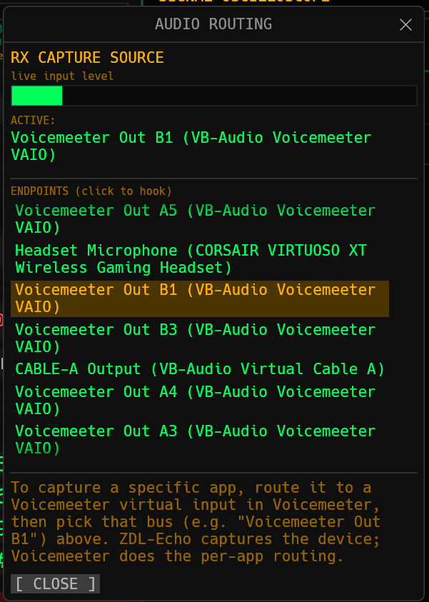
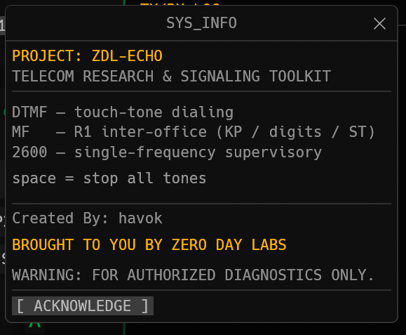
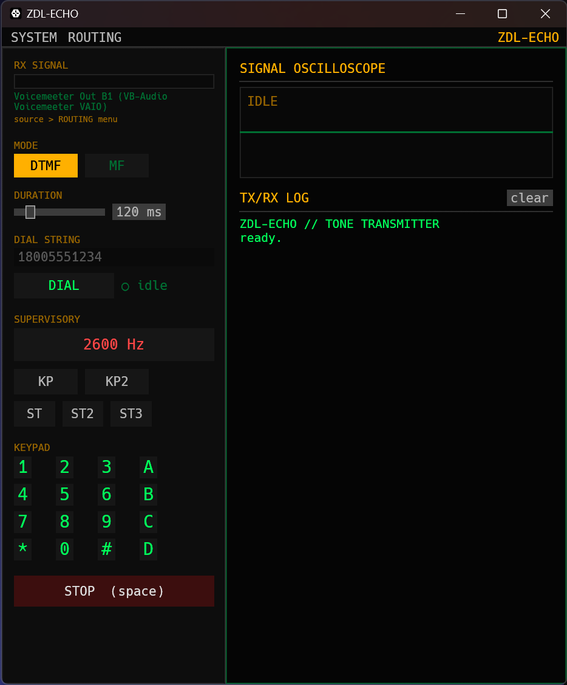

# ZDL-Echo

[](LICENSE)
[](https://github.com/ZeroDay-Labz/ZDL-Echo/releases)
[](https://github.com/ZeroDay-Labz/ZDL-Echo/actions/workflows/release.yml)

[https://github.com/ZeroDay-Labz/ZDL-Echo](https://github.com/ZeroDay-Labz/ZDL-Echo)

**ZDL-Echo** is a professional-grade Telecom Research & Signaling Toolkit engineered for the generation and analysis of legacy telecommunications signaling protocols. Designed by Zero Day Labs, this tool provides a unified interface for testing DTMF (Dual-Tone Multi-Frequency), MF (Multi-Frequency R1), and SF (Single-Frequency 2600 Hz) trunk signaling.

---

## Visual Overview

| Audio Routing Menu | Operational Context   | Main Interface |
| :--- |:-----------------------------| :--- |
|  |  |  |

---

## Capabilities

* **Dual-Engine Architecture:** Simultaneous TX generation and RX detection using non-blocking, multi-threaded DSP pipelines separated by crossbeam channels, with an explicit low-latency buffer negotiation pass so the RX self-echo mute window tracks the real audio path instead of a flat guess.
* **Advanced Voice-Falsing Rejection:** Core DSP engine utilizes phase coherence, twist limits (max 8.0 dB), and strict energy dominance thresholds to reject background speech and noise.
* **Protocol Support:**
  * **DTMF:** Standard touch-tone generation and decoding.
  * **MF (R1):** Inter-office signaling including KP, ST, and digit sets.
  * **SF:** Single-frequency trunk supervision (2600 Hz TX). RX detection is off by default to avoid voice-falsing — toggle **"detect 2600 Hz on RX"** in the SUPERVISORY panel to enable it; the setting is remembered between runs.
* **Real-Time Visualization:** Native oscilloscope rendering with auto-scaling for live signal analysis.
* **Dynamic Audio Routing:** Cross-platform hardware endpoint scanning (WASAPI on Windows, CoreAudio on macOS, ALSA/PipeWire on Linux) with hot-swapping and on-demand device list refresh.
* **Sequence Dialing:** Built-in dial string processor with automated millisecond timing gaps for reliable sequence transmission.
* **Settings Persistence:** Last-used input/output device, mode, tone duration, and the SF RX toggle are restored on the next launch.
* **Log Export:** Save the TX/RX log to a timestamped text file from the log panel.

---

## System Requirements

* **OS:** Windows 10/11, Linux, or macOS 10.14+
* **Audio Infrastructure:**
  * **Windows:** **[Voicemeeter](https://vb-audio.com/Voicemeeter/)** is recommended for routing a specific application's audio into the ZDL-Echo RX capture stream.
  * **Linux (PipeWire/WirePlumber):** No extra software is required to route real hardware devices — pick them directly in the **ROUTING** menu. To capture a specific application's output instead, use a patchbay such as [`qpwgraph`](https://github.com/rncbc/qpwgraph) or [`helvum`](https://gitlab.freedesktop.org/pipewire/helvum) (or `pw-link` on the command line) to connect that application's output to ZDL-Echo's input, the same role Voicemeeter plays on Windows.
* **Compiler (building from source):** Rust 1.85+ (Edition 2024)

---

## Installation

Pre-built artifacts are attached to each [GitHub release](https://github.com/ZeroDay-Labz/ZDL-Echo/releases).

**Linux**

```bash
# Debian / Ubuntu
sudo dpkg -i ZDL-Echo-amd64.deb

# Fedora / RHEL / openSUSE
sudo rpm -i ZDL-Echo-x86_64.rpm
# or: sudo dnf install ./ZDL-Echo-x86_64.rpm

# Flatpak (local bundle, not on Flathub)
flatpak install --user ZDL-Echo.flatpak

# tar.gz (any distro, no install — just run the binary)
tar xzf ZDL-Echo-linux-x86_64.tar.gz
./zdl-echo-*/zdl-echo
```

**Windows** — download and run `ZDL-Echo.exe`.

**macOS** — download `ZDL-Echo-macOS.zip`, unzip, and run `ZDL-Echo.app`.

---

## Setup & Audio Routing

To analyze signals from specific applications:

**Windows (Voicemeeter):**
1. **Configure Virtual Audio:** Install Voicemeeter and set your target application's output to *Voicemeeter Input (Virtual Cable)*.
2. **Hook the Stream:** Launch ZDL-Echo, navigate to the **ROUTING** menu in the top bar, and select the corresponding *Voicemeeter Output* as your **RX CAPTURE SOURCE**.

**Linux (PipeWire/WirePlumber):**
1. Launch ZDL-Echo, then open a patchbay (`qpwgraph`/`helvum`) or run `pw-link`.
2. Connect your target application's output ports to ZDL-Echo's input ports (ZDL-Echo appears under the input device you selected in the **ROUTING** menu).
3. If you add or remove audio devices while ZDL-Echo is running, reopen the **ROUTING** window to refresh the device list.

**All platforms:** The `SIGNAL OSCILLOSCOPE` provides real-time waveform visualization, and the `TX/RX LOG` spools captured signaling data (savable via the **save log** button).

---

## Building from Source

This project uses `cpal` for low-latency audio hardware access and `egui` for GPU-accelerated rendering. The build profile is heavily optimized for DSP math operations and binary size reduction.

```bash
# Clone the repository
git clone https://github.com/ZeroDay-Labz/ZDL-Echo.git
cd ZDL-Echo

# Linux only: audio + windowing headers
sudo apt-get install -y libasound2-dev libx11-dev libxkbcommon-x11-dev libwayland-dev libxkbcommon-dev

# Compile for production
cargo build --release
```

The compiled executable will be generated at `target/release/ZDL-Echo` (`ZDL-Echo.exe` on Windows).
*On Windows, the application is linked to the Windows Subsystem natively, ensuring it launches as a standalone GUI without a background terminal console.*

---

## Technical Specifications

| Component | Technology |
| :--- | :--- |
| **DSP Core** | Optimized Goertzel Algorithm (2nd-Order IIR) |
| **Concurrency** | Crossbeam Channel-based messaging |
| **UI Framework** | Eframe / Egui |
| **Hardware IO** | CPAL (Cross-Platform Audio Library), explicit low-latency buffer negotiation |
| **Settings** | Hand-rolled key=value config file (no external serialization dependency) |
| **Compiler Optimization** | LTO enabled, single codegen unit, stripped symbols |

---

## Legal & Compliance Disclaimer

**ZDL-Echo is provided strictly for educational and authorized research purposes only.** Unauthorized access to telecommunications infrastructure, interception of communications, or fraudulent use of signaling systems may be illegal. Ensure you have explicit authorization before connecting this software to any PSTN or radio network. By using this software, you agree to assume all liability for its operation.

---

*"Brought to you by Zero Day Labs."*
